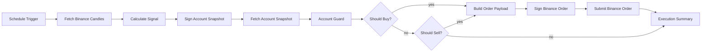

# Binance 自动交易工作流

位于 `docs/workflows/binance-auto-trading.json` 的工作流示例演示如何在 n8n 中串联 Binance 现货 API，周期性拉取 K 线、基于双均线策略产出买卖信号，并在满足条件时自动下单。文中所有参数和节点都可在导入后按需调整。

## 架构一览

## 前提条件

- 一个启用了交易权限的 Binance API Key/Secret。**务必先在 [Binance Testnet](https://testnet.binance.vision/) 验证策略**，只在充分回测后才切换主网。
- n8n 0.236+，且 `Code` 节点允许访问 `process.env`（默认开启，如有自定义可通过 `N8N_BLOCK_ENV_ACCESS_IN_NODE=false` 放通）。
- 将下列环境变量写入 n8n 根目录 `.env` 或对应部署方式：

| 变量 | 说明 | 示例值 |
| --- | --- | --- |
| `BINANCE_API_KEY` | Binance API Key，用于 `X-MBX-APIKEY` Header | `test-key` |
| `BINANCE_API_SECRET` | Binance API Secret，签名节点会用它生成 HMAC | `test-secret` |
| `BINANCE_API_BASE` | Binance API 根路径，方便在 Testnet 与 Mainnet 间切换 | `https://testnet.binance.vision` |
| `BINANCE_SYMBOL` | 交易对 | `BTCUSDT` |
| `BINANCE_INTERVAL` | K 线周期 | `1m` |
| `BINANCE_CANDLE_LIMIT` | 每次取回的 K 线根数，用于 SMA 计算 | `50` |
| `BINANCE_SHORT_SMA` / `BINANCE_LONG_SMA` | 兼容字段，旧版 SMA 周期（会被 EMA 配置覆盖） | `7` / `25` |
| `BINANCE_SHORT_EMA` / `BINANCE_LONG_EMA` | 快慢 EMA 周期，用于判断信号 | `9` / `21` |
| `BINANCE_SIGNAL_THRESHOLD` | 兼容字段，旧版 SMA 偏差阈值（会被 EMA 配置覆盖） | `0.001` |
| `BINANCE_EMA_THRESHOLD` | EMA 差值阈值，`0.001` 表示短 EMA 相对长 EMA ±0.1% 时触发信号 | `0.0008` |
| `BINANCE_QUOTE_ORDER_QTY` | 下单金额（计价货币） | `50` |
| `BINANCE_RECV_WINDOW` | Binance `recvWindow`，毫秒 | `5000` |
| `BINANCE_BASE_ASSET` / `BINANCE_QUOTE_ASSET` | 交易对的基础币与计价币，不填则按 `SYMBOL` 自动推断 | `BTC` / `USDT` |
| `BINANCE_MIN_QUOTE_RESERVE` / `BINANCE_MIN_BASE_RESERVE` | 账户风控保留额度，低于该值时阻断交易 | `10` / `0.0005` |

> 如果要在 Binance Spot Testnet 运行，只需把 `BINANCE_API_BASE` 设成 `https://testnet.binance.vision`，所有 HTTP 节点都会自动切换。

## 节点配置说明

- **Schedule Trigger**：默认每分钟执行一次。可在节点参数中指定 Cron 表达式、开始/结束时间或更长的执行间隔。
- **Fetch Binance Candles (HTTP Request)**：GET `api/v3/klines`，带上交易对、K 线粒度与窗口大小。该节点就是 K 线数据源，后续所有指标都基于它的返回值。
- **Calculate Signal (Code)**：把 K 线收盘价数组转换成快慢 EMA（同时保留 SMA 作为参考），计算 `emaDelta` 并基于 `BINANCE_EMA_THRESHOLD` 输出 `BUY`/`SELL`/`HOLD` 信号。若未设置 EMA 周期/阈值，会回退到旧版 SMA 参数；一旦 Binance 返回的 K 线少于 `max(BINANCE_SHORT_EMA, BINANCE_LONG_EMA)`，节点会直接输出 `signal: HOLD` 并在 `reason/diagnostics` 中写出不足原因，避免整条工作流报错。
- **Execution Summary (Code)**：统一输出结构。若订单成功，会写出 Binance 返回的 `orderId`、成交量和策略指标（包含 `shortEma`、`longEma`、`emaDelta` 等字段）；若信号被风控拦截则会附带 `guard` 快照与 `guardReason`，便于下游通知或审计。
- **Sign Account Snapshot (Code)**：根据 `BINANCE_API_SECRET`、`BINANCE_RECV_WINDOW` 生成访问账户资产所需的 HMAC 签名。
- **Fetch Account Snapshot (HTTP Request)**：GET `api/v3/account`，请求会自动带入签名及 `X-MBX-APIKEY` Header，一次性取回全部资产列表。
- **Account Guard (Code)**：读取账户快照与策略信号，计算基础币/计价币余额是否高于 `BINANCE_MIN_*_RESERVE`。若资金不足，该节点会把信号降级为 `HOLD` 并写入阻断原因。
- **Should Buy? / Should Sell? (If)**：两个条件节点按顺序判断信号并将数据导向下游。如果都不满足则直接进入 `Execution Summary`，不触发下单。
- **Build Order Payload (Code)**：根据信号拼出 `MARKET` 报价单（字段包含 `symbol`、`side`、`quoteOrderQty`、`timestamp` 等），并保留策略指标方便日后追踪。
- **Sign Binance Order (Code)**：使用 `BINANCE_API_SECRET` 对 Query String 做 HMAC-SHA256 签名，兼容 Binance 所需格式。
- **Submit Binance Order (HTTP Request)**：POST `api/v3/order`，把签名后的字段作为 Query Parameters，Header 中注入 `X-MBX-APIKEY`。如要启用 Testnet，请改用对应基础 URL。

## 常见报错与排查

- **Problem in node “Calculate Signal” / `xx candles`**：`Calculate Signal` 会先检查 Binance 返回的 K 线数量，若少于 `max(BINANCE_SHORT_EMA, BINANCE_LONG_EMA)`，就无法计算 EMA。这会导致旧版工作流直接抛错，如今会降级成 `signal: HOLD` 并把原因写在 `reason` 以及 `diagnostics.issue === 'INSUFFICIENT_CANDLES'` 中。排查步骤：
  1. 确认 `BINANCE_CANDLE_LIMIT` 是否被设置成了小于所需数量的值（需要至少 `max(short,long) + 100` 根 K 线），或干脆删掉该变量让示例自动计算。
  2. 如果请求了足够的根数但 Binance 只返回十几根，说明交易对/周期缺少历史数据，可尝试：① 换更长的 `BINANCE_INTERVAL`（如从 `1m` 改成 `5m`/`15m`/`1h`）；② 减小 EMA 周期（例如 `BINANCE_SHORT_EMA=5`、`BINANCE_LONG_EMA=15`）；③ 将 `BINANCE_CANDLE_LIMIT` 设成一个 Binance 实际能够返回的值并配合更长区间。
  3. 观察 `Execution Summary` 输出中的 `reason` 与 `diagnostics`，该字段会列出交易对、请求的根数、实际收到的根数与建议值，方便把信息写入日志或告警。

## 导入与验证步骤

1. 在 n8n Editor UI 选择 **Import from File**，指向 `docs/workflows/binance-auto-trading.json`。
2. 导入后进入 **Credentials** 面板，新建「HTTP Header Auth」或任何安全存储方式，把 `BINANCE_API_KEY/SECRET` 以环境变量或凭证形式注入。
3. 先把 `Schedule Trigger` 改成 **Manual Trigger** 或暂时禁用触发器，使用右上角 **执行当前节点** 的方式手动跑一遍，确认信号、账户快照与风控阻断逻辑都正常（`Execution Summary` 中会出现 `guard` 字段与原因）。
4. 在 `.env` 中把 `BINANCE_API_BASE` 设为 `https://testnet.binance.vision`，在沙箱资金账户验证整套流程，确认仓位变化与 `Execution Summary` 输出一致。
5. 恢复 `Schedule Trigger` 并激活工作流，同时在 Binance 侧开启 IP 白名单、现货下单限额，避免策略异常导致重大损失。

## 安全与扩展建议

- **凭证隔离**：推荐使用 n8n Credential 实体或外部 Secrets Manager（如 Vault、AWS Secrets Manager）托管 API Key。仅在 `Code` 节点中访问 `process.env`，避免 hardcode。
- **账户风控**：`Account Guard` 会在余额不足时降级信号并记下 `guardReason`，可配合 `BINANCE_MIN_*_RESERVE` 调整持仓冗余，必要时把该输出接入告警渠道。
- **速率与重试**：Binance 对 `api/v3/order` 有严格速率限制。可在 HTTP 节点 `Options` 中配置 `retryOnFail`、`maxRetries`，或添加 `Wait` 节点节流。
- **风险控制**：根据需求扩展更多节点，例如：
  1. 在 `Execution Summary` 之后加 `Slack`/`Teams` 通知，推送成交与仓位信息。
  2. 引入 `Set` + `Google Sheets` 写入交易日志。
  3. 通过 `IF` 节点叠加额外指标（RSI、ATR）或账户余额检查，防止超配。
- **异常处理**：可以为该工作流配置 Error Workflow（Settings → Error Workflow），在下单失败或 Binance 返回错误时自动告警。

该示例只是一个起点，请结合自身策略、风控要求与 Binance 最新 API 文档进一步扩展。***
